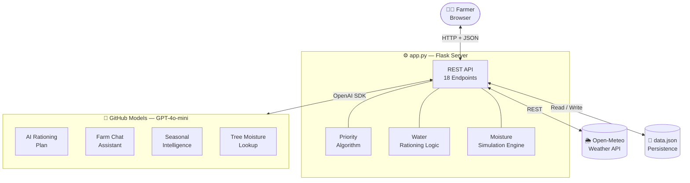

# Farm Water Agent 💧🌾

An AI-powered irrigation management system that rations water intelligently across agricultural fields prioritizing thirsty crops, predicting tank runout, and letting you talk to your farm in plain language.

> Built for: **Agents League Hackathon — Creative Apps**

---

## The Problem

Farmers in Tunisia face extreme heat and unpredictable rainfall. My father runs multiple fields all fed by the same water tank and managing them by hand gets overwhelming fast. Different crops have different water needs at different times of year, and it's easy to lose track.

Last year, by over-focusing on peppers and potatoes, his olive production suffered badly. He lost money and more importantly, wasted water he couldn't afford to waste.

That's what this project is trying to fix.

## The Solution

Farm Water Agent continuously monitors soil moisture across all fields, runs an AI rationing engine to decide *who gets water and how much*, and surfaces the answer through a real-time dashboard — with a chat assistant you can ask in plain language.

---

## Features

- **AI Water Rationing** — LLM analyzes moisture deficits, crop types, field area, and seasonal status to produce a prioritized irrigation plan with per-field allocations and reasoning
- **Tank Runout Prediction** — calculates how many days of water remain based on current field conditions and tank level; updates live after every action
- **AI Farm Chat** — floating assistant that answers natural language questions: *"Which field needs water most urgently?"*, *"Should I irrigate given tomorrow's rain?"*
- **Seasonal Intelligence** — AI determines whether each crop is in peak season and adjusts water allocation accordingly
- **Weather Integration** — pulls live 3-day precipitation data from Open-Meteo (Tunisia) and factors it into irrigation advice
- **Moisture History Chart** — tracks soil moisture over time per field with Chart.js visualizations
- **Emergency Mode** — one button triggers AI rationing and auto-applies the plan when tank drops below 20%
- **Apply Plan** — AI rationing plan can be applied in one click, activating all recommended fields automatically
- **AI vs Manual Savings** — tracks and compares water used through AI decisions vs. manual actions

---

## Demo

> Demo video under construction

Screenshots:
- Dashboard overview with field cards and tank status
- AI rationing plan with per-field allocations
- Chat assistant answering a live question
- Tank runout prediction with urgency color coding

---

## Tech Stack

| Layer | Technology |
|-------|-----------|
| Backend | Python 3.8+, Flask, Flask-CORS |
| AI / LLM | OpenAI-compatible API (GitHub Models — GPT-4o-mini) |
| Weather | Open-Meteo API (free, no key required) |
| Frontend | Vanilla HTML5 / CSS3 / JavaScript |
| Charts | Chart.js |
| Persistence | JSON file (`data.json`) |

---

## Project Structure

```
farm-water-agent/
├── app.py              # Flask backend + embedded frontend + all LLM logic
├── data.json           # Persisted field and tank state
├── requirements.txt    # Python dependencies
├── .env                # GITHUB_TOKEN (not committed)
└── README.md
```

---

## Architecture



**Data flow in plain English:**

1. The browser talks to Flask over HTTP — every button press is a REST call
2. Flask runs the priority algorithm and water rationing logic locally (no AI needed for basic decisions)
3. For anything that requires intelligence — rationing plan, chat, seasonal advice, tree moisture targets — Flask calls GPT-4o-mini via the GitHub Models OpenAI-compatible endpoint
4. Weather data is fetched from Open-Meteo (free, no API key) and passed into LLM prompts as context
5. All field state, tank level, and moisture history are persisted to `data.json` between restarts

---

### Prerequisites
- Python 3.8+
- GitHub Token with Models API access

### Setup

```bash
# 1. Clone
git clone https://github.com/Amaaaan7/smart-irrigation-ai.git
cd smart-irrigation-ai

# 2. Virtual environment
python -m venv venv
source venv/bin/activate       # Windows: venv\Scripts\activate

# 3. Install dependencies
pip install -r requirements.txt

# 4. Set your GitHub token
echo "GITHUB_TOKEN=your_token_here" > .env

# 5. Run
python app.py
```

Open `http://localhost:5000` in your browser.

---

## How It Works

### Prioritization

Each field gets a priority score based on current vs. target moisture:

| Priority | Condition |
|----------|-----------|
| 🔴 Critical | Moisture < 30% |
| 🟠 High | Moisture < (target − 10%) |
| 🟡 Medium | Moisture < target |
| 🟢 Low | Moisture ≥ target |

### AI Rationing Engine

When you run **AI Rationing Plan**, the LLM receives:
- All field states (moisture, priority, area, tree count, crop type)
- Current tank level
- Weather forecast (rain in next 3 days)
- Seasonal status per crop

It returns a structured JSON plan with exact liter allocations per field and a plain-English reason for each decision.

### Tank Runout Prediction

```
total_water_per_cycle = Σ (target − current) × area × 0.01  for each field
days_remaining = tank_level / total_water_per_cycle
```

Assumes one full irrigation cycle per day. Updates after every field action.

### AI Farm Chat

The chat endpoint builds a complete farm snapshot at request time and sends it as context to GPT-4o-mini. The model has access to exact moisture levels, tank status, weather forecast, and field priorities — so answers are grounded in real numbers, not generalities.

---

## API Reference

| Endpoint | Method | Description |
|----------|--------|-------------|
| `/` | GET | Dashboard |
| `/api/fields` | GET | List all fields |
| `/api/fields` | POST | Create a field |
| `/api/fields/<id>` | DELETE | Delete a field |
| `/api/fields/<id>/water/toggle` | POST | Toggle watering on/off |
| `/api/distribute` | GET | Fields with computed priority + water needed |
| `/api/water-tank` | GET | Tank level and capacity |
| `/api/water-tank/refill` | POST | Refill tank by amount |
| `/api/tank-capacity` | POST | Update tank capacity |
| `/api/simulate` | POST | Simulate moisture drift (sensor update) |
| `/api/ai-rationing` | GET | Generate AI water rationing plan |
| `/api/weather` | GET | 3-day precipitation forecast |
| `/api/season` | GET | Seasonal status per crop type (AI, cached) |
| `/api/tree-knowledge` | POST | AI lookup of optimal moisture for a tree type |
| `/api/savings` | GET | AI vs manual water savings comparison |
| `/api/runout-prediction` | GET | Days until tank runs out |
| `/api/chat` | POST | Natural language farm assistant |
| `/api/reset-demo` | POST | Reset to initial demo state |

---

## Configuration

Edit these constants at the top of `app.py`:

```python
TANK_CAPACITY = 5000    # liters
WATER_TANK    = 5000    # current level on fresh start
```

Weather coordinates are hardcoded to Tunisia (lat 36.8, lon 10.18). Change `get_weather_forecast()` in `app.py` to use your location.

---

## Future Work

- Database persistence (SQLite / PostgreSQL) to replace flat JSON
- IoT sensor integration for real soil moisture data
- Multi-user authentication and per-farm isolation
- Configurable location for weather data
- Predictive scheduling based on moisture decay rate
- Mobile-responsive UI improvements

---

## Environmental Impact

Agriculture accounts for ~70% of global freshwater use. Targeted irrigation — watering only what needs it, only when it needs it — is one of the highest-leverage ways to reduce that number. This system is a step toward making that accessible without expensive hardware.

---
Development Timeline
June 4, 2026: Environment setup, Flask installation, basic dashboard scaffold, and repository configuration. (Pre-event preparation due to timezone confusion — clarified with Microsoft Reactor Team.)
June 5–12, 2026: Core hackathon build period — priority algorithm, LLM integration, water distribution logic, demo video, and submission materials.
